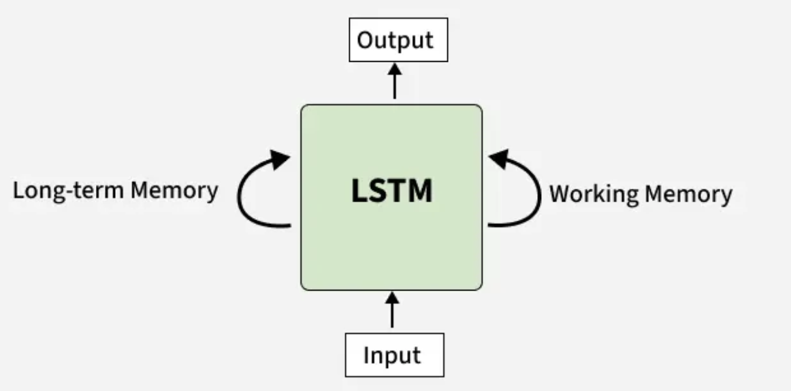
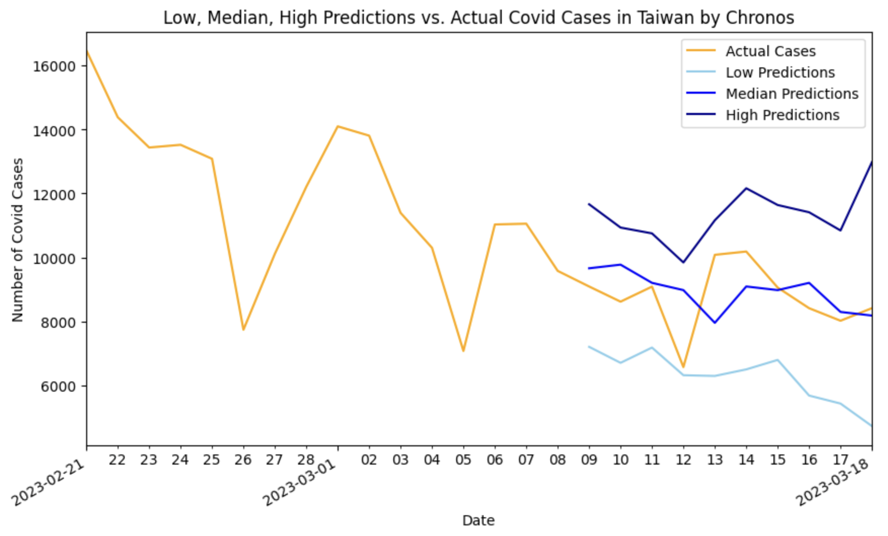

# What is a time series?
A time series is a sequence of data points that are recorded over **consistent intervals** of time. Examples include hourly or daily temperature data, monthly credit card charges, and the annual GDP growth rates. <br>
<br>
Time series modeling is frequently used in **finance** (e.g., stock market forecasting), **economics** (e.g., inflation or CPI projections), **business** (e.g., monthly sales or inventory analysis), **climatology** (e.g., El Niño cycles and global warming trend detection), **health** (e.g., patient vitals or disease outbreak monitoring), and many fields in **science**. <br>

## Examples of helpful uses for our everyday lives
- **Forecasting** of future events and trends allows for better planning and more efficient risk management or mitigation strategies. For instance, using weather and traffic forecasts to plan trips.<br>

- **Pattern recognition** helps with earlier diagnosis and focused treatment. <br>

- **Anomaly detection** uncovers fraudulent credit card charges or suspicious bank activities. <br>

## Key characteristics of time series data
- **Trend** refers to the **long-term movement** of the data, which can be upward, downward, or flat. A good example is the stock market. Despite its ups and downs, there is an upward long-term trend.<br>  

- **Seasonality** refers to **regular, predictable** patterns that occur within a fixed period. Good examples include the Christmas season (for sales forecasting) and the summer season (for flight passenger projections). <br>

- **Cyclic** fluctuations are irregular in terms of timing and duration of occurrence, such as boom and bust cycles.<br>

- **Noise / random variations** are unpredictable fluctuations that cannot be accounted for by the trend or seasonality.<br>

- **Stationarity** is a characteristic where the statistical properties (like mean and variance) are constant over time. Many statistical models require the time series data to be "detrended" to achieve stationarity before any modeling can be performed.<br>
<br>

 <br>
 <sub> Source: [Seasonal Decomposition of Your Time-Series](http://alkaline-ml.com/pmdarima/1.8.1/auto_examples/arima/example_seasonal_decomposition.html) </sub>
 <br>

## What makes time series different from "regular" data?
The unique characteristics of time series data necessitate a different approach than that for typical machine learning datasets.<br> 

First, due to the inherent **temporal dependency** in time series data, random splitting—which is common for other data types assumed to be independent—is inappropriate. Instead, the recommended method is a **time-based split**, where earlier observations are used to train, while later ones are unseen observations designated for testing, with the goal of matching how a time series model would be used in practice for forecasting future values.<br>

Also, as a time series is a **sequence** of data points recorded over **consistent intervals** of time, any **missing time steps** or **uneven intervals** are disruptive to the sequence and will require remediation before modeling.
Main differences that set time series data apart from “regular” data are summarized as follows:<br>


|                      | Time Series       | "Regular" Data       |
|:---------------------|:------------------|:----------------------
| Order & Time         | Essential         | Unimportant usually  |   
| Data Point Dependency| Dependent         | Independence assumed |
| Purpose              | Forecasting       | Understanding        |
| Analysis             | Specialized models| Standard models  | 


## Common issues with time series modeling
- **Missing values and random fluctuations** require data imputation or noise filtering. <br>

- **Non-stationarity and heteroskedasticity** require transformations like differencing or decomposition for the former, and a log transformation for the latter.  <br>

- **Structural breaks** or regime changes occur when there are sudden shifts in the underlying pattern. <br>


## Ways to model time series
- **Traditional (statistical) methods** include **ARIMA** (Auto-Regressive Integrated Moving Average) and **VAR** (Vector Autoregression). The former models data with trends/seasonality by differencing to make it stationary, and it is effective for univariate, linear data. The latter is a multivariable extension of ARIMA for multiple related series. <br>

- **Newer machine learning methods** include tree-based models (**random forest**, **XGBoost**) that can capture complex interactions.<br>

- **Newer deep learning methods** include long short-term memory (**LSTM**), a type of recurrent neural network (RNN),  convolutional neural networks (**CNN**), and **Transformers**, which are increasingly used in time series for long-range dependencies.<br>
<br>

# Case study: predicting Covid-19 cases in Taiwan
## Background
- Over [7 million deaths](https://data.who.int/dashboards/covid19/deaths?m49=001&n=c) and nearly [779 million cases](https://data.who.int/dashboards/covid19/cases?m49=001&n=c) from Covid-19 have been recorded globally as of November 2025.<br>

- Taiwan’s early response resulted in low numbers of cases and deaths until early 2022.<br>

- From March 2022, Taiwan gradually lifted pandemic-related restrictions after reaching 79% in vaccination coverage.<br>

- Shortly after, there were sharp increases in deaths and cases. Three epidemic waves were observed from 4/17/2022 to 3/18/2023; each seemed “flatter” than the previous.<br>
<br>
<br>
<br>

## A tale of two countries
Every country has a different epidemic curve for Covid-19 due to different values, policies, preventive measures, availability of vaccines, etc. The juxtaposition below illustrates the differences. <br>

<br>
  <sub> Source: [Johns Hopkins University ](https://coronavirus.jhu.edu/region/united-states) </sub>
 <br>

## The research question
Given the uniqueness of Taiwan's epidemic waves of Covid-19, how well can machine learning methods forecast Covid cases in Taiwan? <br>
<br>

# Training a Long Short-Term Memory (LSTM) model from scratch

## What is an LSTM model?
[Long Short-Term Memory](https://www.geeksforgeeks.org/deep-learning/deep-learning-introduction-to-long-short-term-memory/) (LSTM) models are an enhanced version of the Recurrent Neural Network (RNN) that can simultaneously capture both long and short-term dependencies in sequential data. They are often used for tasks such as language translation, speech recognition, music generation, image captioning, and **time series forecasting**.<br> 

Unlike traditional RNNs, which use a single hidden layer passed through time, LSTMs are equipped with a memory cell that retains information over extended periods, helping to overcome the challenge of learning long-term dependencies.<br>

## Advantages of LSTM models
RNNs often encounter issues with either **vanishing gradients** or **exploding gradients**. The former refers to how the gradients, which help the model learn, can shrink over time as they pass through many steps, rendering earlier information almost irrelevant. In contrast, exploding gradients can become too large over time, leading to model instability. When information from distant time steps "explodes", it is difficult for the model to learn properly and produce accurate, reliable predictions. <br>

LSTM's advantages lie in its architecture, which includes not only the standard input and output gates, but also a **forget gate** that determines what information is removed from the memory cell. This architecture allows LSTM networks to selectively retain or discard information as it flows through the network, enabling them to **learn long-term dependencies without vanishing or exploding gradients**. <br>


 <sub> Source: [What is LSTM - Long Short Term Memory?](https://www.geeksforgeeks.org/deep-learning/deep-learning-introduction-to-long-short-term-memory/) </sub>
<br>

## LSTM model setup
In this study, the LSTM model was trained to predict the daily Covid cases using Covid cases from the past 5 days, which is the window for short-term (working) memory. Conceptually, the input-output matrix looks like this: <br>

| Input      | Output| 
|:-----------|:------|
|1  2  3  4 5| 6     |
|2  3  4  5 6| 7     | 
|3  4  5  6 7| 8     | 

<br>
Or, if it is easier to conceptualize in terms of day of the week:<br>

| Input              | Output| 
|:-------------------|:------|
|MON TUE WED THU FRI | SAT   |
|TUE WED THU FRI SAT | SUN   | 
|WED THU FRI SAT SUN | MON   | 

<br>
This LSTM model consists of five layers: <br>

- Layer **1** Data type: **Sequential** <br>

- Layer **2** Input layer: **Input** <br>

- Layer **3** Model type: **LSTM** <br>

- Layer **4** Action function: **ReLU** (Rectified Linear Unit)<br> 
- Layer **5** Output layer: **Linear**<br>
<br>

## LSTM modeling results comparison: Temperatures vs. Covid Cases
Due to the magnitude of Covid cases, the daily totals were "normalized" to range between 0 and 10 by dividing by 10,000 before training. The predicted results were then multiplied by 10,000 to get back to the original unit (number of cases).<be>

To test the LSTM model, two different datasets were used for training: daily temperatures (in Celsius) of Park Slope, NY, from 2010-01-01 to 2025-09-30, and daily Covid cases in Taiwan from 2022-04-17 to 2023-03-18. <br>
<br> 
Below is a comparison table of the two datasets on their sample sizes, value ranges, training specifications, and the minimum percentage difference between predicted and actual values.<br>
<br>

|                      | Temperature    | Covid Cases   |
|:---------------------|:---------------|:--------------|
| No. of Samples       | 5,752          | 336           |
| Predicted Value Range| 19.24 ~ 22.42  | 12,330        |
| Window Size          | 5              | 5             |
| Learning Rate        | 0.01           | 1.0           |
| Epochs               | 200            | 200           |
| Min Error Magnitude  | 0.4%           | 21%           |
| Max Error Magnitude  | 21%            | 54%           |

<br>

## Good for predicting temperatures, but not for Covid cases?
Compared to its performance on the temperature dataset, the LSTM model completely missed the mark in predicting Covid cases in Taiwan during the study period. Why is this the case (pun intended)?<br>
<br>
<br>
<br>

## Reasons for poor performance in Covid case prediction
- **Dataset is too small** (only 336 observations). The five-layer LSTM model used in this study has over 17,425 parameters, and a general rule of thumb for neural networks is to have at least 10 to 20 samples per parameter.<br>
<br>  
- **Not enough repeated patterns**. Without repeated patterns, the "long-term memory" component of LSTM offers little value.<br>
<br>
- **Big difference in the magnitude** of daily cases between the training dataset and the testing dataset.<br>
<br>

<br>
 <br>

# Fine-tuning a pre-trained model
Conceptually, one can copy and paste the small dataset, say, 100 times to create artificial repeated patterns and see if the model does any better. However, this can create other modeling and analysis issues. <br>
<br>
So, what if there is already a model that was pretrained on millions of samples? Would a pre-trained model perform better than the LSTM model if the study's small dataset is provided as the context for fine-tuning? <br>
<br>

## Amazon Chronos 
[Amazon Chronos](https://www.amazon.science/code-and-datasets/chronos-learning-the-language-of-time-series) is a group of pre-trained time series forecasting models based on the transformer architecture (similar to Large Language Models for text) that predict future data points (such as temperature and sales data) by transforming numbers into a sequence of tokens via scaling and quantization. <br>

Pre-trained on massive, diverse datasets, Chronos promises to deliver reliable forecasts for data from different fields without any prior training. Converting numerical data into sequences allows standard language model architectures to find complex patterns for forecasting. <br> 
<br>

## Chronos-T5 (Tiny) fine-tuning specification
Chronos-T5 (Tiny) has 8M parameters. To perform inference with Chronos models, first install the package in the GitHub companion repo by running:<br>

```python
!pip install git+https://github.com/amazon-science/chronos-forecasting.git
```
Then, import the necessary libraries:<br>

```python
import matplotlib.pyplot as plt
import numpy as np
import pandas as pd
import torch
from chronos import ChronosPipeline
```
Next, specify the pipeline: <br>

```python
pipeline = ChronosPipeline.from_pretrained(
    "amazon/chronos-t5-tiny",
    device_map="cpu",
    torch_dtype=torch.bfloat16,
)
```

Then, define the length of prediction and assign context to the model:<br>

```python
# Define prediction length
prediction_length = 10

# Extract NoOfCases from study_period_df (less the prediction_length) and assign to the variable Cases. 
# The last 10 observations of actual number of cases were withheld to compare with Chronos' predicted values.
end_index = len(study_period_df) - prediction_length
Cases = study_period_df['NoOfCases'][:end_index]

# Convert Cases to a numpy array
Cases = torch.Tensor(Cases.to_numpy())

# Assign Cases as context for pretrained model
context = torch.tensor(Cases)
```

Next, specify the forecast using context and prediction length: <br>

```python
forecast = pipeline.predict(context, prediction_length)
```

Finally, define the 10%, 50%, and 90% percentiles as low, median, and high predictions, respectively. The bounds of low and high predictions form the **80% Prediction Interval** in this study. One can change the prediction interval by changing the percentiles. <br>

```python
low, median, high = np.quantile(forecast[0].numpy(), [0.1, 0.5,0.9], axis=0)
```

## Results 
The table below summarizes the results from performing inference with the Chronos-T5 (Tiny) pre-trained model using Taiwan's Covid cases as context. These results are compared with the forecasting performance by training an LSTM model from scratch.<br>

Fine-tuning Chronos outperforms training an LSTM model on a small dataset consisting of 336 observations. Nevertheless, for small datasets, statistical methods generally outperform machine learning methods, whose forte is modeling large, complex data. <br>  
<br>

| Covid Cases          | Chronos Fine-Tuning | LSTM Training  |
|:---------------------|:--------------------|:---------------|
| No. of Samples       | 326                 | 336            |
| Predicted Value Range| 7,957 ~ 9,776       | 12,330         |
| Window Size          | na                  | 5              |
| Learning Rate        | na                  | 1.0            |
| Epochs               | na                  | 200            |
| Min Error Magnitude  | 1%                  | 21%            |
| Max Error Magnitude  | 37%                 | 54%            |

<br>
The table below shows the 10%, 50% (median), and 90% percentile predictions by Chronos. The median predictions offer the best results, with the minimum percentage difference between predicted and actual values at 1%, while the maximum was 37%. <br>

!INSERT IMAGE HERE <br>
 <br>

The line plot below shows that the actual number of Covid cases in orange, while the predicted values at 10%, 50%, and 90% percentiles are shown in different shades of blue. The plot illustrates the actual number of cases falls well within the 80% Prediction Interval, or the area between the light blue and dark blue lines. <br>

<br>
 <br>

# Key takeaways
1. Choosing the right type of model that is a "good fit" (pun intended) for the dataset is the first step towards successful modeling.<br>

2. Machine learning is not just an overkill, but rather the wrong tool altogether for small datasets, as its strength lies in modeling large, complex datasets. For smaller datasets, traditional statistical methods outperform machine learning models.<br>

3. Time series data with drastically different magnitudes and few repeated patterns pose a modeling challenge in that the training dataset does not bear any resemblance to the validation and test datasets.<br>

4. Despite the risk of getting broken links and missing packages, pre-trained models trained on a large collection of diverse data may outperform task-specific models trained from scratch. <br>

# Future research
1. Fine-tuning Chronos with a larger dataset (> 1,000 samples) of daily Covid cases in Taiwan (from 2020-01-22 to 2023-06-01), where the majority of the time series consists of very low numbers of cases. 

2. Conducting a multivariable statistics model (such as Vector Autoregression) in which Covid cases, temperature, and vaccination rate could be used to predict Covid deaths. <br>

3. Adding sine and cosine functions to further remove seasonality for datasets with many repeated patterns, such as the temperature data. <br>
<br>

# Resources
- [Temp_11215.csv](assets/css/Temp_11215.csv) <br>
- [Daily_Covid_Cases_Taiwan.csv](assets/css/Daily_Covid_Cases_Taiwan.csv) <br>
- [LSTM Time Series Forecasting Tutorial in Python](https://www.youtube.com/watch?v=c0k-YLQGKjY)<br>
- [Install Chronos AI Models for Time Series Forecasting](https://www.youtube.com/watch?v=WxazoCVkBhg)<br>
- [Amazon Chronos-T5 (Tiny)](https://huggingface.co/amazon/chronos-t5-tiny) <br>
