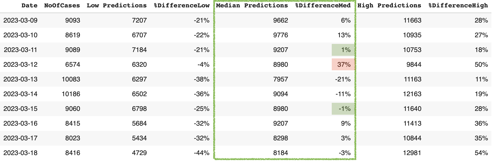

# What is a time series?
A time series is a sequence of data points that are recorded over **consistent intervals** of time. Examples include hourly or daily temperature data, monthly credit card charges, and the annual GDP growth rates. <br>
<br>
Time series modeling is frequently used in **finance** (e.g., stock market forecasting), **economics** (e.g., inflation or CPI projections), **business** (e.g., monthly sales or inventory analysis), **climatology** (e.g. El Niño cycles and global warming trend detection), **health** (e.g. patient vitals or disease outbreak monitoring), and many fields in **science**. <br>
<br>

## Key characteristics
- **Trend** <br>
- **Seasonality** <br>
- **Cyclic** <br>
- **Noise / randomn variation** <br>
- **Stationarity** <br>
<br>

 <br>
 <sub> Source: [Seasonal Decomposition of Your Time-Series](http://alkaline-ml.com/pmdarima/1.8.1/auto_examples/arima/example_seasonal_decomposition.html) </sub>
 <br>

## Common issues with time series modeling
- **Missing values and random fluctuations** require data imputation or noise filtering. <br>
- **Non-stationarity and heteroskedasticity** require transformations like differencing or decomposition for the former, and log transformation for the latter.  <br>
- **Structural breaks** or regime changes when there are sudden shifts in the underlying pattern. <br>
<br>

## Examples of helpful uses for our everyday life
- **Forecasting** of future events and trends allows for better planning and more efficient risk management or mitigation strategies. For instance, use of weather and traffic forecasts to plan trips.<br>
- **Pattern recognition** helps earlier diagnosis and focused treatment. <br>
- **Anomaly detection** uncovers fradulent credit card charges or suspicious bank activities. <br>
<br>
<br>

## What makes time series different from "regular" data?

|                      | Time Series       | "Regular" Data       |
|:---------------------|:------------------|:----------------------
| Order & Time         | Essential         | Unimportant usually  |   
| Data Point Dependency| Dependent         | Independence assumed |
| Purpose              | Forecasting       | Understanding        |
| Analysis             | Specialized models| Standard regression  | 

<br>

## Ways to model time series
- **Traditional (statistical) methods** include **ARIMA** (AutoRegressive Integrated Moving Average) and **VAR** (Vector Autoregression). The former models data with trends/seasonality by differencing to make it stationary and is effective for univariate, linear data. The latter is a multivariable extension of ARIMA for multiple related series. <br>
<br>
- **Newer machine learning methods** include tree-based models (**random forest**, **XGBoost**) that can capture complex interactions.<br>
<br>
- **Newer deep learning methods** include long short-term memory (**LSTM**) and convolutional neural networks (**CNN**), and Transformers, which is increasingly used in time series for long-range dependencies.<br>
<br>
<br>

# Case study: predicting Covid-19 cases in Taiwan
## Background
- Over [7 million deaths](https://data.who.int/dashboards/covid19/deaths?m49=001&n=c) and nearly [779 million cases](https://data.who.int/dashboards/covid19/cases?m49=001&n=c) from COVID-19 have been recorded globally as of November 2025.<br>
<br>
- Taiwan’s early response resulted in low numbers of cases and deaths until early 2022.<br>
<br>
- From March 2022, Taiwan gradually lifted pandemic-related restrictions after reaching 79% in vaccination coverage.<br>
<br>
- Shortly after, there were sharp increases in deaths and cases. Three epidemic waves were observed from 4/17/2022 to 3/18/2023, each seemed “flatter” than the previous.<br>
<br>
<br>
<br>
<br>

## A tale of two countries
Every country has a different epidemic curve for Covid-19 due to different values, policies, preventive measures, availability of vaccines, etc. The juxtaposition below is a visual representation of said differences. <br>
<br>
<br>
 <br>

## The research question
Given the uniqueness of Taiwan's epidemic waves of Covid-19, how well can machine learning methods forecast Covid cases in Taiwan? <br>
<br>

# Training a LSTM model from scratch

## What is a LSTM model?

## Advantages of LSTM models


## LSTM model setup
Predict Covid cases using Covid cases from the past 5 days
The input-output matrix would look like this: <br>

| Input      | Output| 
|:-----------|:------|
|1  2  3  4 5| 6     |
|2  3  4  5 6| 7     | 
|3  4  5  6 7| 8     | 

<br>
Or, if it is easier to conceptualize in terms of day of the week:<br>
<br>

| Input              | Output| 
|:-------------------|:------|
|MON TUE WED THU FRI | SAT   |
|TUE WED THU FRI SAT | SUN   | 
|WED THU FRI SAT SUN | MON   | 

<br>

## LSTM modeling results comparison
Due to the magnitude of Covid cases, the daily totals were "normalized" to range between 0 and 10 by dividing by 10,000 before training. The predicted results were then multiplied by 10,000 to get back to the original unit (number of cases).<be>

To test the LSTM model, two different datasets were used for training: daily temperatures (in Celsius) of Park Slope, NY from 2010-01-01 to 2025-09-30, and daily Covid cases in Taiwan from 2022-04-17 to 2023-03-18. <br>
<br> 
Below is a comparison table of the two datasets on their respective sample size, range of values, training specifications, and minimum difference between predicted and actual values as a percentage of the actual value.<br>
<br>

|                      | Temperature    | Covid Cases   |
|:---------------------|:---------------|:--------------|
| No. of Samples       | 5,752          | 336           |
| Predicted Value Range| 19.24 ~ 22.42  | 12,330        |
| Learning Rate        | 0.01           | 1.0           |
| Epochs               | 200            | 200           |
| Min Error Magnitude  | 0.4%           | 21%           |
| Max Error Magnitude  | 21%            | 54%           |

<br>

## Good for predicting temperatures but not for Covid cases?
Compared to its performance on the temperature dataset, the LSTM model completed missed the mark in predicting Covid cases in Taiwan during the study period. Why is this the case (pun intended)?<br>
<br>
<br> <br>
<br>

## Reasons for poor performance on Covid cases prediction
- **Dataset is too small** (only 336 observations). The five-layer LSTM model used in this study has over 17,425 parameters, and a general rule of thumb for neural networks is to have at least 10 to 20 samples per parameter.<br>
<br>  
- **Not enough repeated patterns**. Without repeated patterns, the "long-term memory" component of LSTM offers little value.<br>
<br>
- **Big difference in the magnitude** of daily cases betweening the training dataset and the testing dataset.<br>
<br>

<br>
 <br>

# Fine-tuning a pre-trained model
Conceptually, one can copy and paste the small dataset, say, 100 times to create artificial repeated patterns and see if the model does any better. However, this can create other modeling and analysis issues. <br>
<br>
So, what if there is already a model that was pretrained on millions of samples? Would a pre-trained model perform better than the LSTM model if the study's small dataset is provided as the context for fine-tuning? <br>
<br>

## Amazon Chronos 
[Amazon Chronos](https://www.amazon.science/code-and-datasets/chronos-learning-the-language-of-time-series) is a group of pre-trained time series forecasting models based on transformer architecture (similar to Large Language Models for text) that predicts future data points (like temperature and sales data) by transforming numbers into a sequence of tokens via scaling and quantization. <br>

Pre-trained on massive, diverse datasets, Chronos promises to deliver reliable forecasts for data from different fields without any prior training. By converting numerical data into sequences, it allows standard language model architectures to find complex patterns for forecasting. <br> 
<br>

## Chronos-T5 (Tiny) fine-tuning specification
Chronos-T5 (Tiny) has 8M parameters. To perform inference with Chronos models, first install the package in the GitHub companion repo by running:<br>

```python
!pip install git+https://github.com/amazon-science/chronos-forecasting.git
```
Then, import the necessary libraries:<br>

```python
import matplotlib.pyplot as plt
import numpy as np
import pandas as pd
import torch
from chronos import ChronosPipeline
```
Next, specify the pipeline: <br>

```python
pipeline = ChronosPipeline.from_pretrained(
    "amazon/chronos-t5-tiny",
    device_map="cpu",
    torch_dtype=torch.bfloat16,
)
```

Then, define the length of prediction and assign context to the model:<br>

```python
# Define predciton length
prediction_length = 10

# Extract NoOfCases from study_period_df (less the prediction_length) and assign to the variable Cases. 
# The last 10 observations of actual number of cases was withheld to compare with Chronos' predicted values.
end_index = len(study_period_df) - prediction_length
Cases = study_period_df['NoOfCases'][:end_index]

# Convert Cases to an numpy array
Cases = torch.Tensor(Cases.to_numpy())

# Assign Cases as context for pretrained model
context = torch.tensor(Cases)
```

Next, specify forecast using context and prediction length: <br>

```python
forecast = pipeline.predict(context, prediction_length)
```

Finally, define the 10%, 50%, and 90% percentiles as low, median, and high predictions, respectively. The bounds of low and high predictions form the **80% Prediction Interval** in this study. One can change the prediciton interval by changing the percentiles. <br>

```python
low, median, high = np.quantile(forecast[0].numpy(), [0.1, 0.5,0.9], axis=0)
```

## Results 
The table below summarizes the results from performing inference with Chronos-T5 (Tiny) pre-trained model using Taiwan's Covid cases as context. These results are compared with the forecasting performance by training a LSTM model from scratch.<br>

It is apparant that fine-tuning of Chronos outperforms training a LSTM model with a small set of data consisting of 336 samples. Nevertheless, for small datasets, statistical methods generally outperforms machine learning methods whose forte is modeling large, complex data. <br>  
<br>

| Covid Cases          | Chronos Fine-Tuning | LSTM Training  |
|:---------------------|:--------------------|:---------------|
| No. of Samples       | 326                 | 336            |
| Predicted Value Range| 7,957 ~ 9,776       | 12,330         |
| Learning Rate        | na                  | 1.0            |
| Epochs               | na                  | 200            |
| Min Error Magnitude  | 1%                  | 21%            |
| Max Error Magnitude  | 37%                 | 54%            |

<br>
The table below show the 10%, 50% (median), and 90% percentile predictions by Chronos. The median predictions offer the best results, as the minimum difference between predicted and actual values as a percentage of actual values was as low as 1%, while the maximum was 37%. <br>

<br>
 <br>

The line plot below shows the actual number of Covid cases in orange, while the predicted values at 10%, 50%, and 90% percentiles are shown in different shades of blue. The plot illustrates the actual number of cases falls well within the 80% Prediction Interval, or the area between light blue and dark blue lines. <br>

<br>
 <br>
<br>

# Key takeaways

# Future research
1. Multivariable model in which Covid cases, temperature, vaccination rate would be used to predict Covid deaths. <br>
<br>
2. Adding sine and cosine functions can be added to further remove seasonality for datasets with many repeated pattern, such as the temperature data. <br>
<br>
<br>

# Resources
- [Temp_11215.csv](assets/css/Temp_11215.csv) <br>
- [Daily_Covid_Cases_Taiwan.csv](assets/css/Daily_Covid_Cases_Taiwan.csv) <br>
- [LSTM Time Series Forecasting Tutorial in Python](https://www.youtube.com/watch?v=c0k-YLQGKjY)<br>
- [Install Chronos AI Models for Time Series Forecasting](https://www.youtube.com/watch?v=WxazoCVkBhg)<br>
- [Amazon Chronos-T5 (Tiny)](https://huggingface.co/amazon/chronos-t5-tiny) <br>
<br>