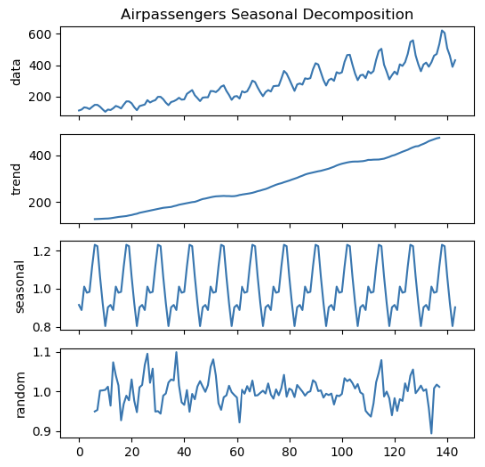
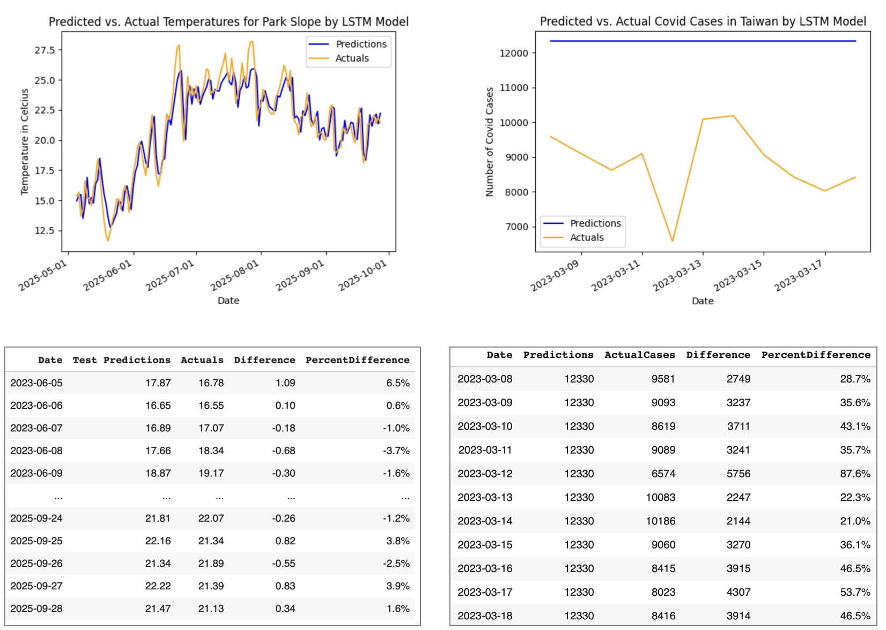
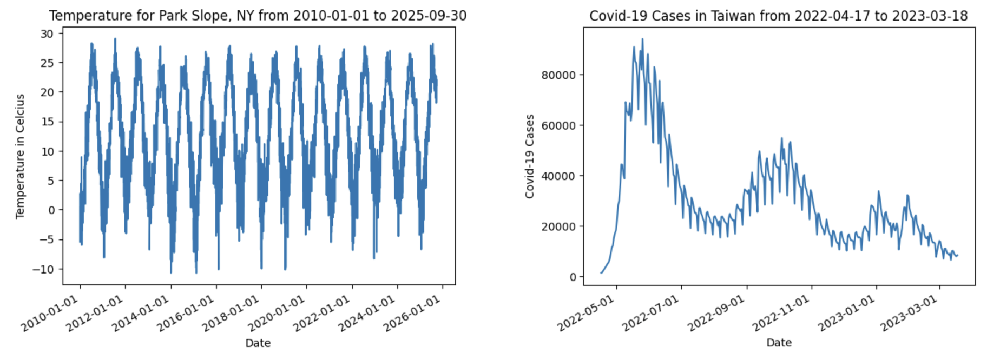

# Time Series Modeling in Machine Learning
# What is a time series?
A time series is a sequence of data points that are recorded over **consistent intervals** of time. Examples include hourly or daily temperature data, monthly credit card charges, and the annual GDP growth rates. <br>
<br>

## Key characteristics
- **Trend** <br>
- **Seasonality** <br>
- **Cyclic** <br>
- **Noise / randomn component** <br>
- **Stationarity** <br>

 <br>
 <sub> Source: [Seasonal Decomposition of Your Time-Series](http://alkaline-ml.com/pmdarima/1.8.1/auto_examples/arima/example_seasonal_decomposition.html) </sub>
 <br>

<br>

# Why use a time series model?

# What makes time series different?

# Ways to model time series data in machine learning
- **Traditional methods**
- **Newer methods**

# Case study: predicting Covid-19 cases in Taiwan
## Background
- Over [7 million deaths](https://data.who.int/dashboards/covid19/deaths?m49=001&n=c) and nearly [779 million cases](https://data.who.int/dashboards/covid19/cases?m49=001&n=c) from COVID-19 have been recorded globally as of November 2025.<br>
<br>
- Taiwan’s early response resulted in low numbers of cases and deaths until early 2022.<br>
<br>
- From March 2022, Taiwan gradually lifted pandemic-related restrictions after reaching 79% in vaccination coverage.<br>
<br>
- Shortly after, there were sharp increases in deaths and cases. Three epidemic waves were observed from 4/17/2022 to 3/18/2023, each seemed “flatter” than the previous.<br>
<br>
 <br>
<br>
<br>

## A tale of two countries
Every country has a different epidemic curve for Covid-19 due to different values, policies, preventive measures, availability of vaccines, etc. The juxtaposition below is a visual representation of said differences. <br>
<br>
 <br>
 <br>

## The research question
Given the uniqueness of Taiwan's epidemic waves of Covid-19, how well can machine learning methods forecast Covid cases in Taiwan? <br>
<br>

# Training a LSTM model from scratch

## What is a LSTM model?

## Advantages of LSTM models

## LSTM modeling results comparison
### Good for temperatures but not for Covid cases?
Compared to its performance on the temperature dataset, the LSTM model completed missed the mark in predicting Covid cases in Taiwan during the study period. Why is this the case (pun intended)?<br>
<br>
 <br>
 <br>

## Reasons for the poor performance
- **Dataset is too small** (only 336 observations). The five-layer LSTM model used in this study has over 17,425 parameters, and a general rule of thumb for neural networks is to have at least 10 to 20 samples per parameter.<br>
<br>  
- **Not enough repeated patterns**. Without repeated patterns, the "long-term memory" component of LSTM offers little value.<br>
<br>
- **Big difference in the magnitude** of daily cases betweening the training dataset and the testing dataset.<br>
<br>

 <br>
 <br>

# Fine-tuning a pretrained model
Conceptually, one can copy and paste the small dataset, say, 100 times to create artificial repeated patterns and see if the model does any better. <br>
<br>
But what if there is already a model that was pretrained on millions of samples? Would the pretrained model perform better than the LSTM model if the study's small dataset is provided as the context for fine-tuning? <br>
<br>

## Chronos fine-tuning specification

<br>

<br>

```python
!pip install git+https://github.com/amazon-science/chronos-forecasting.git
```


<br>

## Results 


# Key takeaways

# Future research
<br>
<br>

* * *
# Resources
- [LSTM Time Series Forecasting Tutorial in Python](https://www.youtube.com/watch?v=c0k-YLQGKjY)<br>
- [Install Chronos AI Models for Time Series Forecasting](https://www.youtube.com/watch?v=WxazoCVkBhg)<br>
- [Amazon Chronos-T5 (Tiny)](https://huggingface.co/amazon/chronos-t5-tiny) <br>
<br>

 

###### Header 6

| head1        | head two          | three |
|:-------------|:------------------|:------|
| ok           | good swedish fish | nice  |
| out of stock | good and plenty   | nice  |
| ok           | good `oreos`      | hmm   |
| ok           | good `zoute` drop | yumm  |


